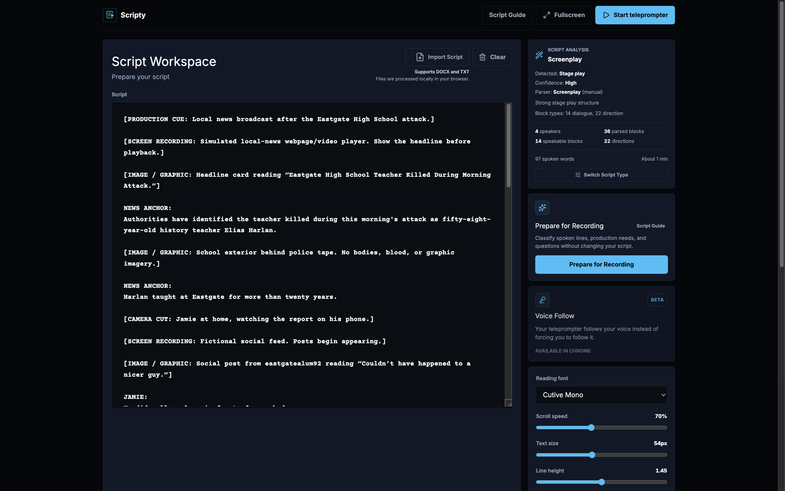
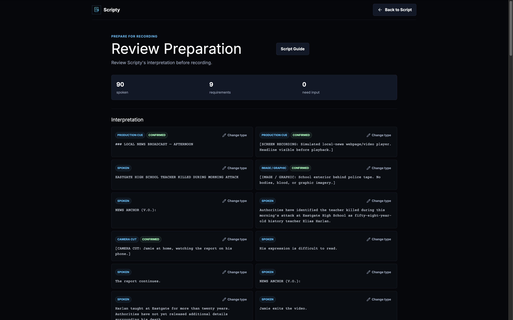
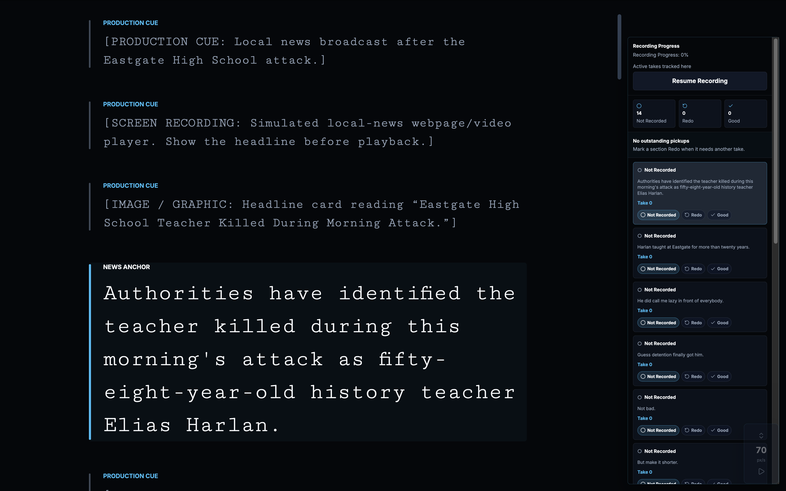
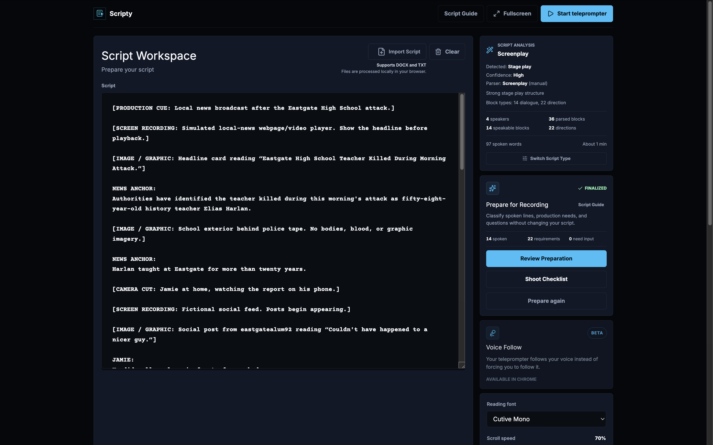
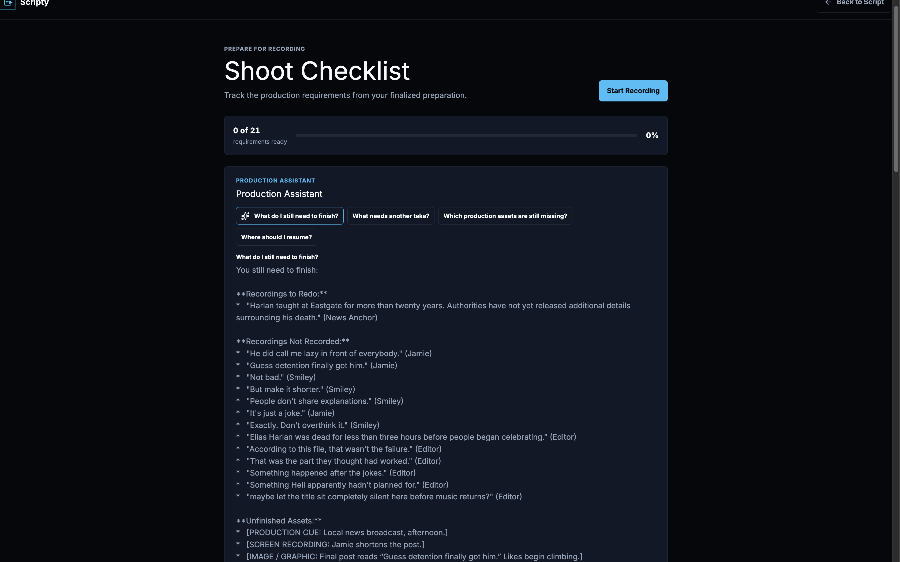

# Scripty

Scripty turns a creator's script into an executable recording-production workflow: prepare the script, perform it, track the work, and ask what remains.

**Live Demo:** Pending

**Demo Video:** Pendinga 

**Hackathon / ClickHouse Track:** Built for the Google Cloud Agentic Cinema Hackathon and entered in the ClickHouse track.

## What Scripty Does

A production script is more than dialogue. It can contain production cues, B-roll ideas, graphics, reminders, props, recording decisions, and assets that must be completed. Scripty keeps those concerns connected through one workflow:

1. Paste a script or import a TXT or DOCX file in the Script Workspace.
2. Prepare identifies spoken content and production work without changing the source text.
3. Review classifications, resolve uncertainty, and finalize creator-owned decisions.
4. Record with the teleprompter, timed scrolling, or Voice Follow.
5. Track each recording section as Not Recorded, Redo, or Good; log takes and notes; then work pickups.
6. Complete the Shoot Checklist for production requirements.
7. Sync that current production state to ClickHouse and use the Production Assistant to ask grounded status questions.

## The Problem

Creators do not merely need a teleprompter. They need a practical way to carry a script through production: what to say, what to show, which takes need another pass, which assets are still missing, and where to resume. Scripty keeps that work in one focused workflow instead of scattering it across a script editor, a checklist, and ad hoc notes.

## How It Works

Scripty's parser establishes the structural blocks in the script. Prepare then classifies those parser-owned blocks into production semantics such as Spoken, B-Roll, Image / Graphic, Screen Recording, AI Video, Camera Cut, Prop, Creator Reminder, and Unknown.

Gemini can improve those semantic classifications, but it receives the parser's existing segment IDs and text. It cannot create, merge, split, reorder, or rewrite script segments. The application validates the structured response, and the local Prepare provider remains the deterministic fallback. The creator reviews and finalizes the result; corrections become the prepared production state used by the teleprompter and checklist.

During recording, Scripty turns recordable sections and active checklist items into a Production Memory snapshot. The server syncs that snapshot to ClickHouse. The Production Assistant later asks a constrained Google ADK agent to query the current, production-scoped ClickHouse state through the official ClickHouse MCP server.

## Key Features

- **Script Workspace:** paste text or import TXT and DOCX scripts; inspect parser output, speakers, and reading settings.
- **Deterministic script parsing:** parser modes detect or allow selection of screenplay and stage-play structures while keeping paragraph-level spoken blocks for teleprompter use.
- **Prepare for Recording:** classifies parser-owned segments into spoken content, production cues, B-Roll, images/graphics, screen recordings, AI video, camera cuts, props, creator reminders, and unclear items.
- **Gemini-assisted Prepare with local fallback:** Gemini returns strict JSON classifications for supplied segment IDs only; invalid, incomplete, unavailable, or timed-out AI results fall back to the local classifier.
- **Human review is authoritative:** Confirmed and Tentative states are visible; creators can confirm, change type or status, resolve unknown items, or ignore them before finalizing. The original script text is never rewritten.
- **Script Guide:** documents supported production terms, statuses, paragraph behavior, and the preparation workflow in-product.
- **Teleprompter:** supports timed scrolling, manual navigation, a countdown, speaker styling, and browser-based Voice Follow (Beta, available in Chrome where speech recognition is supported).
- **Recording Progress:** track Not Recorded, Redo, and Good sections; start and count takes, add notes, resume the next unfinished section, and use Pickup Mode for Redo sections.
- **Shoot Checklist:** turns finalized production requirements into a checklist, supports manual additions, completion tracking, and removal of no-longer-needed items.
- **Production Memory:** records current recording and asset state in ClickHouse, including status, completion, take count, notes, and relevant production metadata.
- **Production Assistant:** offers four fixed, grounded questions: what remains, what needs another take, which assets are missing, and where to resume.
- **Production Completion Summary:** when the “What do I still need to finish?” result is completely done, Scripty displays current-state recording, take, and asset counts with no pickups remaining.

## Agent Architecture

```text
Creator
  |
  v
Scripty React UI
  |
  | POST /api/production-memory/ask
  v
Scripty Node server
  |
  v
Google ADK + Gemini on Vertex AI
  |
  | exactly one constrained run_query call
  v
Official ClickHouse MCP server (Streamable HTTP)
  |
  v
ClickHouse production_memory_items
```

The browser calls only the Scripty server. Google Cloud configuration, ClickHouse connection settings, and optional MCP bearer authentication remain server-side or in the local MCP process; they are never passed through `VITE_*` browser variables.

The Production Assistant is not unrestricted chat. It accepts a fixed set of production questions, gives Gemini an exact production-scoped current-state SQL query, verifies that `run_query` was called exactly once with that query, validates the MCP result, and only then accepts Gemini's final answer.

## Google Cloud + Gemini

Scripty uses the default `gemini-2.5-flash` model unless `GOOGLE_AGENT_MODEL` overrides it. Both Gemini integrations use Vertex AI:

- **Gemini Prepare:** the server uses the Google Gen AI client with Vertex AI enabled. Gemini receives parser mode plus parser-owned IDs, text, speaker, subtype, and parser type. It must return a schema-constrained JSON classification for every supplied ID.
- **Production Assistant:** the Node server uses `@google/adk`, `LlmAgent`, `InMemoryRunner`, and an ADK `MCPToolset`. Gemini interprets a validated ClickHouse result for one of the fixed production questions.

Gemini does **not** decide structural segmentation, invent segment IDs, rewrite the script, generate arbitrary ClickHouse SQL, or supply a successful answer when the required MCP tool result fails validation. Gemini Prepare has a local classification fallback; Production Assistant failures surface as safe errors rather than local answers.

Set `GOOGLE_CLOUD_PROJECT`, `GOOGLE_CLOUD_LOCATION`, `GOOGLE_AGENT_MODEL`, and `GOOGLE_GENAI_USE_VERTEXAI` in the server environment. For local Vertex AI use, authenticate with Application Default Credentials before starting the Scripty server. Do not expose Google credentials or project secrets in browser configuration.

## ClickHouse Integration

ClickHouse is Scripty's durable Production Memory. It makes the assistant useful after the creator changes recording status or completes an asset, because answers are grounded in the persisted current state instead of a cached UI answer.

Scripty uses the official [ClickHouse MCP server](https://github.com/ClickHouse/mcp-clickhouse) over Streamable HTTP. The deterministic server-side sync client uses its `run_query` tool to create and update `production_memory_items`. On the first successful Production Memory sync, Scripty creates `production_memory_items` automatically if it does not already exist. The ADK Production Assistant uses the same MCP endpoint but is restricted to one validated, exact `run_query` call per user request.

The table uses `ReplacingMergeTree(version)` keyed by `(production_id, item_id)`. Current-state reads collapse rows with `argMax(..., version)`, exclude tombstones, and scope every query to one production. Sync reads that current state and inserts only new or changed items; it writes tombstones for items removed from the next snapshot. An unchanged snapshot does not issue an INSERT.

This design preserves repeatable current-state semantics while retaining the history required for versioned replacement. It also keeps agent answers bounded to the creator's active production rather than granting broad database authority.

## Production Memory

Each snapshot derives a stable production ID from the script and parser mode. It contains two kinds of current items:

- **Recording items:** parser-derived recording sections with source ID, speaker, status (`not-recorded`, `redo`, or `good`), completion state, take count, optional note, and update time.
- **Asset items:** active Shoot Checklist requirements with source ID, completion state, type, and requirement status.

The teleprompter and Shoot Checklist each build the same production-scoped snapshot from their existing state and request a debounced sync. A later assistant request reads ClickHouse again, so a completed take or checked asset is reflected when the creator asks another question. The completion summary is deterministic: it appears only when every current recording and asset item is complete.

## Tech Stack

**Frontend**

- React, React Router, Vite
- Lucide icons, React Dropzone, Mammoth for DOCX import
- Browser Speech Recognition for Voice Follow where supported

**Backend**

- Node.js HTTP server
- Server-side request validation and API routes for Gemini Prepare and Production Memory

**AI**

- Google ADK and Google Gen AI SDK
- Gemini through Vertex AI

**Data / MCP**

- ClickHouse
- Official `mcp-clickhouse` server and Streamable HTTP MCP transport

**Testing / Tooling**

- Node test runner
- ESLint
- Vite production build

## Architecture / Project Structure

```text
src/app/                         Application shell and routes
src/features/scripts/             Workspace, parser, import, Guide, Prepare, and checklist
src/features/teleprompter/        Prompt rendering, scrolling, Voice Follow, recording progress
src/features/productionMemory/    Snapshot building, sync, assistant UI, browser API client
server/                           API routes, Gemini agents, MCP client, ClickHouse store and schema
productionMemoryQuestions.js      Fixed Production Assistant question set
.env.example                     Safe local configuration template
```

The parser and Prepare contract live together under `src/features/scripts`. Production Memory's deterministic persistence and agent boundaries live under `server`, while the browser owns only presentation and snapshot creation.

## Getting Started

### Prerequisites

- Node.js with support for `--env-file-if-exists` (used by `npm run server:local`).
- A ClickHouse service and credentials for local Production Memory testing.
- The official `mcp-clickhouse` checkout at `./mcp-clickhouse` with its Python virtual environment at `./mcp-clickhouse/.venv`. The repository's `mcp:local` script expects that local tooling.
- A Google Cloud project configured for Vertex AI and local Application Default Credentials for Gemini features.

### Installation

```bash
npm install
cp .env.example .env
```

Replace only the placeholders in `.env`. The local `.env` file is gitignored; do not commit credentials.

Set up the official ClickHouse MCP checkout once from the project root. `uv sync` creates the `.venv` used by Scripty's `mcp:local` script:

```bash
git clone https://github.com/ClickHouse/mcp-clickhouse.git
cd mcp-clickhouse
uv sync
cd ..
```

### Environment Configuration

`.env.example` separates official MCP-server settings from Scripty server settings. Use placeholder values only in shared documentation or examples.

| Variable | Purpose |
| --- | --- |
| `CLICKHOUSE_HOST`, `CLICKHOUSE_PORT`, `CLICKHOUSE_USER`, `CLICKHOUSE_PASSWORD` | ClickHouse connection used by the local official MCP server. |
| `CLICKHOUSE_SECURE`, `CLICKHOUSE_VERIFY` | TLS connection and certificate verification settings for that ClickHouse connection. |
| `CLICKHOUSE_ALLOW_WRITE_ACCESS`, `CLICKHOUSE_ALLOW_DROP` | MCP server write and drop permissions. Scripty sync needs write access; the template disables drops. |
| `CLICKHOUSE_MCP_SERVER_TRANSPORT`, `CLICKHOUSE_MCP_BIND_HOST`, `CLICKHOUSE_MCP_BIND_PORT`, `CLICKHOUSE_MCP_ALLOWED_HOSTS` | Local MCP HTTP transport and loopback binding. |
| `CLICKHOUSE_MCP_AUTH_DISABLED` | Disables MCP authentication only for the loopback-only local development server. |
| `FASTMCP_JSON_RESPONSE` | Requests JSON tool responses for short-lived local Production Assistant MCP calls. |
| `CLICKHOUSE_MCP_URL` | Scripty server URL for the MCP endpoint. |
| `CLICKHOUSE_MCP_AUTH_TOKEN` | Optional bearer token when the MCP endpoint requires one. Do not enable it in browser code. |
| `GOOGLE_CLOUD_PROJECT`, `GOOGLE_CLOUD_LOCATION` | Vertex AI project and location used by server-side Gemini integrations. |
| `GOOGLE_AGENT_MODEL` | Gemini model name; the template uses `gemini-2.5-flash`. |
| `GOOGLE_GENAI_USE_VERTEXAI` | Must be `true`; the server enforces Vertex AI usage. |

For production, use process environment variables. `npm run server` does not depend on a local `.env` file. Do not set `CLICKHOUSE_MCP_AUTH_DISABLED=true` for an MCP endpoint exposed beyond local loopback.

### Start ClickHouse MCP

In one terminal:

```bash
npm run mcp:local
```

This starts the local official MCP server using `.env`. The template binds it to `127.0.0.1:8000` and configures Scripty to use `http://127.0.0.1:8000/mcp`.

### Start the Scripty Server

In a second terminal:

```bash
npm run server:local
```

The server listens on port `8787` by default and exposes the Gemini Prepare and Production Memory API routes.

### Start the Frontend

In a third terminal:

```bash
npm run dev
```

Vite proxies `/api` requests to `http://localhost:8787` by default. With all three processes running, Prepare can use Gemini with its local fallback, and Production Memory can sync through ClickHouse MCP.

## Demo Workflow

1. Paste or import a script with spoken lines and production instructions such as B-Roll, an image, or a screen recording.

2. Select **Prepare for Recording**.

   

3. Open **Review Preparation** and inspect Confirmed, Tentative, and Needs input items.

   

4. Confirm, change, or ignore uncertain classifications, then select **Finalize & Start Recording** at the bottom of the screen.

5. Scripty opens the teleprompter. Start recording, then use Timed Scroll or Voice Follow where supported.

   

6. Record sections, mark takes **Good** or **Redo**, add notes when useful, and use Pickup Mode for Redo work.

7. When finished in the teleprompter, use **Back to Script**, then open **Shoot Checklist** to review generated production requirements.

   

8. In **Production Assistant**, ask **What do I still need to finish?**

   

9. Change a recording or asset state, allow the Production Memory sync to complete, and ask again to see a newly grounded answer.

10. When all current work is complete, ask **What do I still need to finish?** again to see the Production Completion Summary.

## Testing

```bash
npm test
npm run lint
npm run build
```

`npm test` covers parser behavior, Prepare validation and fallback behavior, recording and teleprompter logic, Production Memory snapshots and sync behavior, MCP result handling, and server routes. `git diff --check` is also useful before committing documentation or code changes.

## Hackathon

Scripty was built for the **Google Cloud Agentic Cinema Hackathon** and entered in the **ClickHouse track**.

- **Google Cloud / Gemini:** interprets parser-owned production segments and produces concise answers from validated production-memory query results.
- **ClickHouse:** retains the versioned, production-scoped current state that makes recording progress and requirements queryable across the workflow.
- **MCP:** connects the server-side deterministic sync path and constrained ADK agent tool call to ClickHouse without exposing database credentials to the browser.

## Learnings

- Structural parsing and probabilistic classification have different responsibilities: the parser owns boundaries, while Gemini adds semantic interpretation.
- Human review must remain authoritative when production intent is uncertain; finalized corrections flow into the checklist and teleprompter model without rewriting the source script.
- Production state is more useful as structured, versioned memory than as a previous AI response or a browser-only snapshot.
- An agent should be grounded and constrained: Scripty validates tool use and tool results instead of trusting a model's final prose after an MCP failure.
- Server-only credential boundaries keep Google Cloud, ClickHouse, and MCP authentication out of the browser bundle.

## License

Copyright © 2026 Ashley Broussard.

This project is licensed under the GNU Affero General Public License v3.0 (AGPL-3.0). See the [LICENSE](LICENSE) file for details.

## Contributing

External code contributions are not currently being accepted. See [CONTRIBUTING.md](CONTRIBUTING.md).

## Contact

Created by Ashley Broussard.

- GitHub: [AshB4](https://github.com/AshB4)
- LinkedIn: [Ashley Broussard](https://www.linkedin.com/in/ashley-m-broussard-33a392253)
- Email: [Fleurdeviefarmsllc@gmail.com](mailto:Fleurdeviefarmsllc@gmail.com)
- Portfolio: [ashb4.github.io](https://ashb4.github.io/)